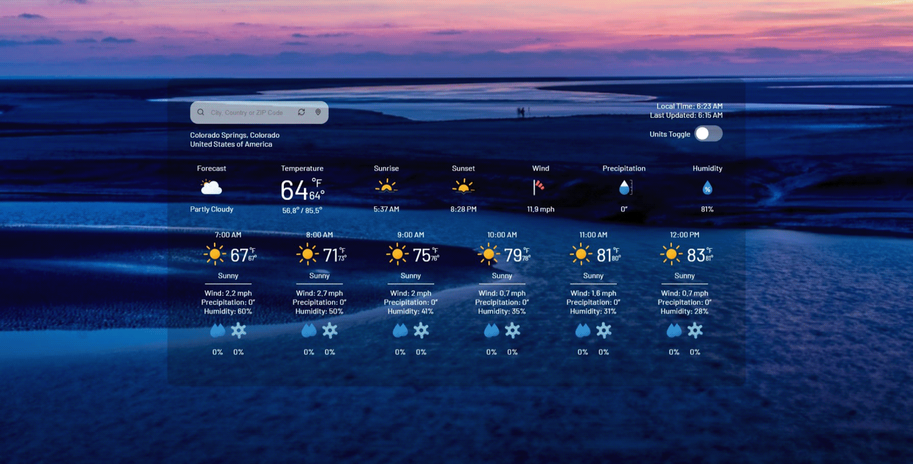

## Early Bird

Early Bird is a **React.js** application that provides real-time weather data (for any location) that dynamically updates the background with stunning images provided by an external **API**, relevant to the current weather conditions and time of day.

This Application utilizes **Hooks**, **Reusable Components**, **CSS Modules** and an organized file structure.

### Features

- **Dynamic Image Retrieval** relevant to the current weather conditions and time of day (_somewhat accurate_)

- **Auto Location Retrieval** using your device's coordinates, falls back to IP location

- **Manual Location Retrieval**

  - _City, Country_
  - _ZIP (US), Postal (UK and Canada)_
  - _Latitude and Longitude (Decimal degree)_
  - _IP Address_

- **Current Weather**

  - _Current temperature, apparent, highs and lows_
  - _Weather conditions, rain and snow forecast_
  - _Astronomical data, sunrise and sunset_
  - _Humidity, precipitation and wind_

- **Hourly Weather** up to 6 hours

- **Units Toggle**

  - _Fahrenheit and Celsius_
  - _Miles and Kilometers_
  - _Inches and Millimeters_
  - _12 and 24 hours_

- **Auto Updates** current location **weather** every 15 minutes

### To-Do

- Responsive Design
- Pictures Attribution
- Error Messages
- 3-Day Forecast
- 24 hourly
- Further code optimization

### Usage

- Visit the website by clicking the **GitHub Pages button** located down bellow
- Your location will be **retrieved automatically** (_reasonably accurate_)
- For a precise locale you must enter either a city name, country, zip code, postal code or latitude and longitude and hit the **search button**
- The **refresh button** updates the weather data for the current location
- The **locate button** detects and display the weather information for your current location

### Live Demo

### Acknowledgments

Special thanks to the following for their invaluable resources that were generously offered free of charge:

- **Weather API**: for providing accurate and real-time weather data
- **Unsplash** for providing a reliable source of high-quality images
- **SVG Repo** for hosting an extensive icon library
- The author of **Meteocons** for providing a gorgeous collection of weather icons
- The author of **Dazzle Line Icons** for providing an elegant icon selection

### Attribution

- [**Weather API**](https://www.weatherapi.com/) is licensed under the [MIT License](https://opensource.org/license/MIT). Please refer to their website for details on usage restrictions and terms of service
- [**Unsplash**](https://unsplash.com/) API is licensed under the [MIT License](https://opensource.org/license/MIT). Please refer to their [license page](https://unsplash.com/license) for more details
- [**SVG Repo**](https://www.svgrepo.com/) is licensed under the **[CC0 1.0 Universal](https://creativecommons.org/publicdomain/zero/1.0/) Public Domain Dedication**. Please refer to their [license page](https://www.svgrepo.com/page/licensing/) for more details
- [**Meteocons**](https://bas.dev/work/meteocons) is licensed under the **MIT License**. See the [MIT License](https://opensource.org/license/MIT) for details
- [**Dazzle Line Icons**](https://www.svgrepo.com/collection/dazzle-line-icons/) is licensed under the **Attribution CC License**. See the [CC BY License](https://creativecommons.org/licenses/by/4.0/) for details

### Contributing

Your contribution is valuable, please feel free to suggest features or report bugs.

### License

This project is licensed under the **GNU General Public License v3.0.** Please refer to the [LICENSE](https://www.gnu.org/licenses/gpl-3.0.html "LICENSE") for more details.
